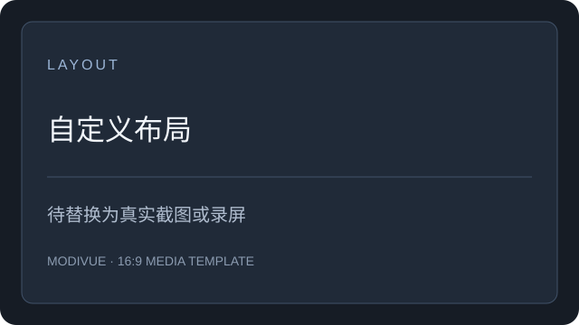
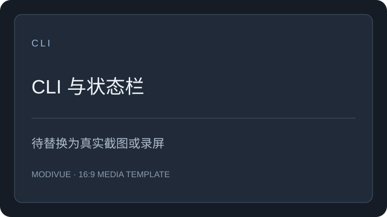

<div align="center">

<h1> Modivue</h1>

**写代码时，一眼看清中转站余额、缓存、首字延迟和模型核验。**

4 项核心指标 · 多种模型核验方法 · 15 个 Agent 工具配置解析 · macOS、Windows 与 CLI

请求记录与报告保存在本机，不需要 Modivue 账号。

[](https://github.com/systemoutprintlnhelloworld/Modivue/actions)
[](https://github.com/systemoutprintlnhelloworld/Modivue/releases)
[](https://github.com/systemoutprintlnhelloworld/Modivue/releases)

[](https://github.com/systemoutprintlnhelloworld/Modivue/releases)
[](https://github.com/systemoutprintlnhelloworld/Modivue/releases)

简体中文

[安装](#安装) · [监测面板](#监测面板) · [模型核验](#模型核验) · [支持的工具](#支持的工具) · [文档](#文档)

<picture>
  <source media="(prefers-color-scheme: light)" srcset="docs/assets/hero-light.svg">
  
</picture>

<br>
<sub>上图是可替换的视觉模板。发布前请替换为真实录屏 GIF 或界面截图。</sub>

</div>

> [!WARNING]
> 当前 macOS 包未公证，Windows 包的签名与实机多 DPI 验收仍未完成。下载前请查看对应 Release 说明。

## 概览

| | Modivue |
|---|---|
| 监测指标 | 余额、Cache 命中率、TTFT 首字延迟、模型核验、检测花费 |
| 统计粒度 | 模型 × 渠道 × Key 分组 × 推理档位，分组后分别统计 |
| 协议 | OpenAI Chat Completions、Responses、Anthropic Messages（流式） |
| 余额来源 | OpenRouter、New API / Sub API、CC Switch、自定义 JSON 字段映射 |
| 平台 | macOS Apple Silicon、Windows 10/11 x64 预览、命令行 |
| 存储 | 本机 SQLite；数据库只保存 API Key 不可逆短指纹。可信渠道凭据若保存，由用户选择并写入本机配置文件 |

## 功能

下方均为待替换的截图模板，不代表真实界面或测量结果。录屏与截图位置见 [素材清单](docs/media.md)。

<table>
<tr>
<td width="33%"><a href="docs/features/overview.md"></a><br><b><a href="docs/features/overview.md">概览与指标趋势</a></b><br>同一目标的核验、Cache、TTFT 和余额趋势。</td>
<td width="33%"><a href="docs/features/island.md"></a><br><b><a href="docs/features/island.md">灵动岛悬浮面板</a></b><br>极简、普通、专注三种形态，按需展开。</td>
<td width="33%"><a href="docs/features/agents.md"></a><br><b><a href="docs/features/agents.md">Agent 状态</a></b><br>发现本机会话，区分配置存在与实际运行。</td>
</tr>
<tr>
<td><a href="docs/features/verification.md"></a><br><b><a href="docs/features/verification.md">模型核验</a></b><br>逐方法保留原始观测和判定依据。</td>
<td><a href="docs/features/cost.md"></a><br><b><a href="docs/features/cost.md">费用与余额</a></b><br>核验成本与各 provider 的余额历史。</td>
<td><a href="docs/features/calibration.md"></a><br><b><a href="docs/features/calibration.md">可信参考与校准</a></b><br>采集同条件分布，记录档案来源与版本。</td>
</tr>
<tr>
<td><a href="docs/features/settings.md"></a><br><b><a href="docs/features/settings.md">设置与通知</a></b><br>检测间隔、分类音效、主题与显示项。</td>
<td><a href="docs/features/overview.md#布局"></a><br><b><a href="docs/features/overview.md#布局">自定义布局</a></b><br>长按区块拖动排序，保存自己的布局。</td>
<td><a href="docs/features/cli.md"></a><br><b><a href="docs/features/cli.md">CLI 与状态栏</a></b><br>读取同一份本地数据，输出结构化状态。</td>
</tr>
</table>

## 监测面板

| 层级 | 触发方式 | 显示内容 |
|---|---|---|
| 极简态 | 默认 | 余额环 |
| Agent 面板 | 鼠标移入 | 正在工作及近期活跃的 Agent |
| 单环详情 | 悬停单个环 | 核验、Cache、TTFT、余额和最近趋势 |
| 主窗口 | 点击模型 | 统计、趋势、告警、日志、核验报告和设置 |

指标缺失时显示缺失状态，不会用 0 代替。TTFT 从请求发出到首个有效文本或工具事件计时。Cache 只使用提供方明确返回的缓存字段。

## 模型核验

核验结果是行为证据，不是人类 IQ，也不是模型身份认证。方法实现、版本和限制见 [MODEL-VERIFICATION.md](MODEL-VERIFICATION.md)。

| 方法 | 检查内容 | 来源或实现 | 基准要求 |
|---|---|---|---|
| 单问题测试 | 自定义题目与参考答案的匹配记录 | [evaluator-question.mjs](src/core/evaluator-question.mjs) | 不需要 |
| Meow 模型指向 | 短答案分布与候选基准的距离 | [meow-llm-detector](https://github.com/chen-006/meow-llm-detector)，[evaluator-meow.mjs](src/core/evaluator-meow.mjs) | 内置 |
| HLWY 分布匹配 | 公共整数分布的众数、余弦和 JS 相似度 | [hlwy-ai-checker](https://github.com/hanlinwenyuan/hlwy-ai-checker)，[evaluator-hlwy.mjs](src/core/evaluator-hlwy.mjs) | 公共基准或可信 API |
| KBF 知识边界 | 16 个历史模型的参考探针，CP99 / 单侧二项检验 | [Ooo0ption/KBF](https://github.com/Ooo0ption/KBF/tree/481c78da14df4f2b02b43d344dae7199ae08cea0) | 内置参考；试采不下完整结论 |
| One Token | 单 token 英文任务的分布差异 | [论文](https://arxiv.org/abs/2607.10252)，[evaluator-one-token.mjs](src/core/evaluator-one-token.mjs) | 先采集 |
| Astra | 社区五类任务的适配观测，未复刻作者精确题库 | [社区原帖](https://linux.do/t/topic/2861517)，[实现](src/core/evaluator-astra.mjs) | 自采同条件参考；不输出原帖强指向结论 |
| Juice | 生成答案中的原始整数，非服务器认证预算 | [需求参考帖](https://linux.do/t/topic/2704354)，[实现](src/core/evaluator-coding.mjs) | 参考帖正文未核实；校准模式需要档案 |
| BazaarLink Probe | 官方异步检测与持续计划 | [Probe API](https://bazaarlink.ai/probe-api-skill.md) | 官方服务 |
| Ztest 官方检测 | 官网浏览器检测流程及报告导入 | [Ztest](https://ztest.ai)，[报告适配](src/core/evaluator-ztest.mjs) | 第三方服务，人机验证由用户完成 |
| 本地多探针 | 五组简单请求，记录回答、失败及耗时 | [Modivue 实现](src/core/evaluator-ztest.mjs) | 不复刻 Ztest 私有探针或评分 |
| 自定义概率探针 | 自定义短答案分布的 JSD 比较 | [参考项目](https://github.com/dreamor/llm-fingerprint)，[实现](src/core/evaluator-coding.mjs) | 同条件档案；未校准阈值时只显示距离 |

> [!NOTE]
> 匹配度不等于身份置信度。HLWY 少于 50 个有效样本仅为预览；One Token 只适配英文 10 类任务，未复现论文四语言全集。主动核验会消耗 token，未知费用仍显示为未知。

## 安装

从 [Releases](https://github.com/systemoutprintlnhelloworld/Modivue/releases) 下载对应平台的包。

| 平台 | 包 | 说明 |
|---|---|---|
| macOS Apple Silicon | `Modivue-macos-arm64.zip` | 解压后将 `Modivue.app` 移到“应用程序”。预览包尚未公证。 |
| Windows 10/11 x64 | `Modivue-windows-x64.zip` | 解压运行 `Modivue.exe`。需要 Edge WebView2 Runtime。 |
| CLI | 源码 `cli/` | Node.js 22.5+，读取桌面端共享数据库。 |

> [!NOTE]
> 现有预览版使用 ZIP。签名 DMG 和 Windows 安装器已有构建流程，但尚未完成证书配置与正式发布，不能当作已有下载。详见 [构建与发布](docs/development.md)。macOS 首次打开被拦截时，仅对你信任的下载在“系统设置 → 隐私与安全性”选择“仍要打开”。

## 支持的工具

当前有 15 个工具的选中 provider 配置解析路径。

<p align="center">
<a href="docs/features/agents.md"></a>
<a href="docs/features/agents.md"></a>
<a href="docs/features/agents.md"></a>
<a href="docs/features/agents.md"></a>
<a href="docs/features/agents.md"></a>
<a href="docs/features/agents.md"></a>
<a href="docs/features/agents.md"></a>
<a href="docs/features/agents.md"></a>
<a href="docs/features/agents.md"></a>
<a href="docs/features/agents.md"></a>
<a href="docs/features/agents.md"></a>
<a href="docs/features/agents.md"></a>
<a href="docs/features/agents.md"></a>
<a href="docs/features/agents.md"></a>
<a href="docs/features/agents.md"></a>
</p>

15 个 Agent badge 均包含品牌图标，并保存在本仓库，不依赖远程图片。来源与许可说明见 [素材归属](docs/assets/NOTICE.md)。

“支持”表示有配置解析或会话发现路径，不表示每个工具都已完成真实上游请求验收。完整清单见 [ROADMAP.md](ROADMAP.md)。

## 文档

| 主题 | 文档 |
|---|---|
| 功能索引 | [docs/features/](docs/features/) |
| 核验原理与局限 | [MODEL-VERIFICATION.md](MODEL-VERIFICATION.md) |
| 多渠道路由与 API | [docs/proxy.md](docs/proxy.md) |
| Claude Code 状态栏 | [cli/STATUSLINE-SNIPPET.md](cli/STATUSLINE-SNIPPET.md) |
| 安全边界 | [隐私与数据边界](#隐私与数据边界) |
| 更新记录与计划 | [HANDOFF.md](HANDOFF.md) · [ROADMAP.md](ROADMAP.md) |

功能文档目前随仓库提供，独立文档站尚未部署。

## 隐私与数据边界

- 本地服务只监听 `127.0.0.1`。
- 请求、核验报告、余额和图表数据写入本机 SQLite。
- 数据库保存 API Key 的不可逆短指纹。用户主动保存的可信渠道凭据可能以本机配置文件明文保存，文件权限限制为当前用户；请按本机安全策略保护它们。
- 主动探测和核验会向配置的上游发请求并产生费用。可以在设置中关闭、调低频率或限制每日请求数。
- 模型目录、公共基准和版本检查会访问各自的远程来源。启用 BazaarLink 或 Ztest 官方检测时，请求交由对应第三方服务处理；不要将“本地保存”理解为“完全离线”。

## 从源码运行

```bash
git clone https://github.com/systemoutprintlnhelloworld/Modivue.git
cd Modivue
npm ci
npm run dev              # http://127.0.0.1:4173
npm run desktop:build    # macOS → dist/Modivue.app
npm run windows:build    # Windows，需要 .NET SDK 8
```

## 许可证

仓库当前尚未选定开源许可证。发布前请以仓库根目录的许可证文件和 Release 说明为准。

## 参与贡献

提交问题时请附上系统、Agent、协议类型、相关日志和可复现步骤。
