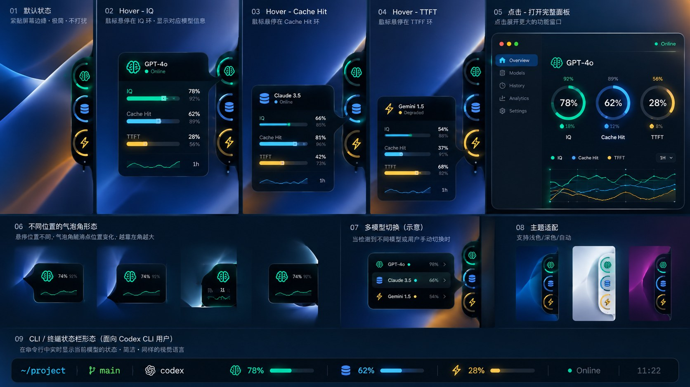
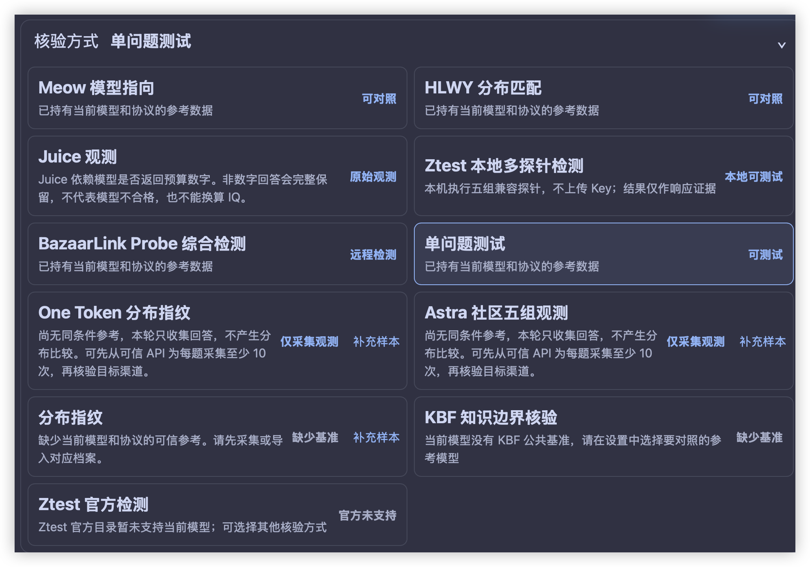
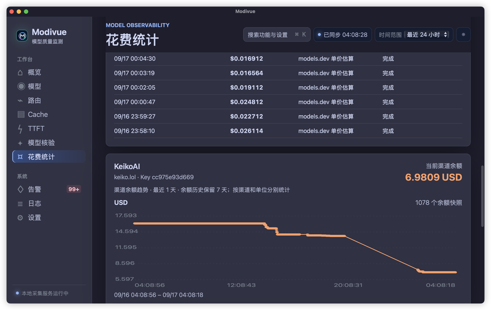
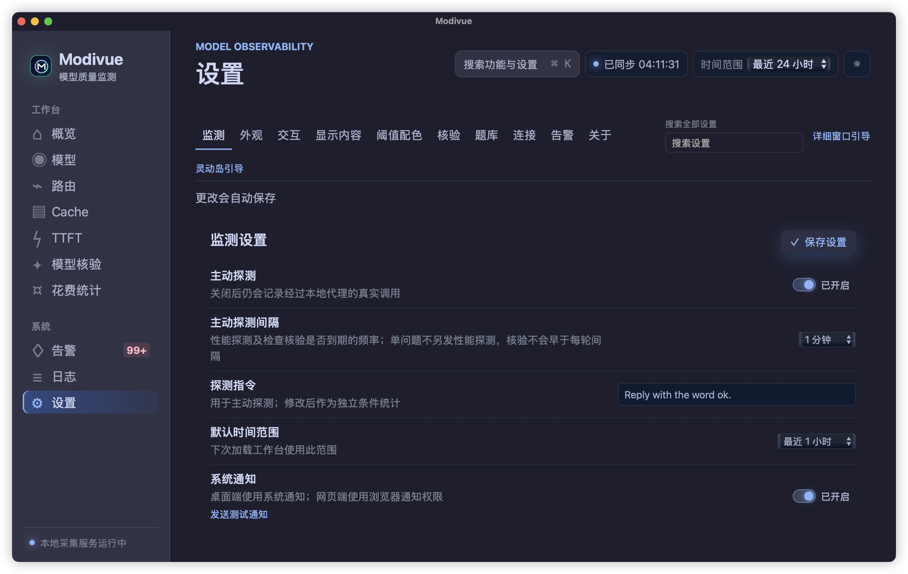
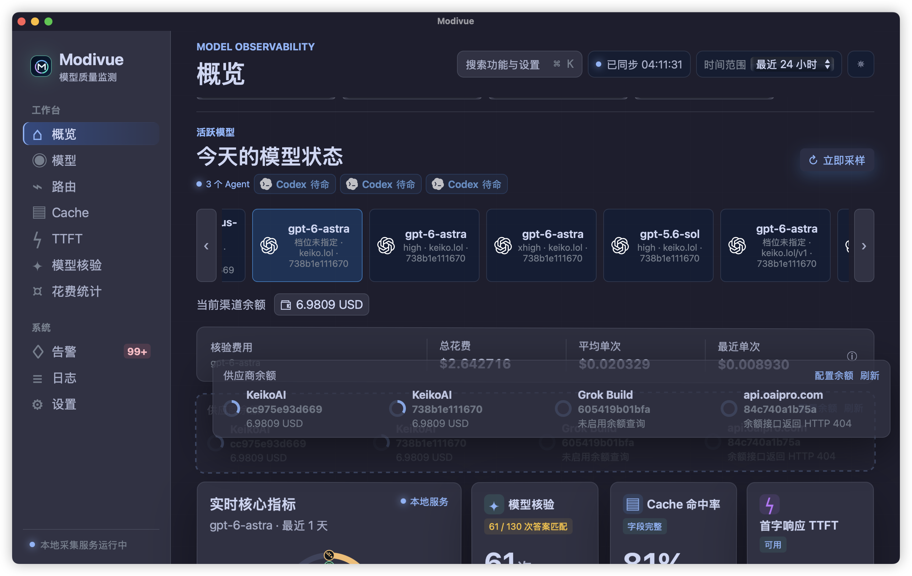
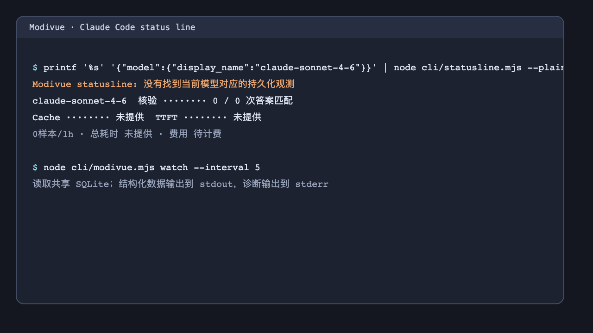

<div align="center">

<!-- 顶部横幅动图。导出静态首帧 hero-banner.png 后，可在 <picture> 内加入：
     <source media="(prefers-reduced-motion: reduce)" srcset="docs/assets/hero-banner.png">
     （该切换在 GitHub 上的效果未实测）。静态首帧同时上传为仓库 Social preview -->
<picture>
  
</picture>

<h1> Modivue</h1>

**你的 Vibe Coding 灵动岛**<br>
中转站余额 · 缓存命中 · 首字延迟 · 模型核验，悬浮一眼看清，数据只留在本机

[](https://github.com/systemoutprintlnhelloworld/Modivue/actions)
[](https://github.com/systemoutprintlnhelloworld/Modivue/releases)
[](https://github.com/systemoutprintlnhelloworld/Modivue/releases)

[](https://github.com/systemoutprintlnhelloworld/Modivue/releases/latest/download/Modivue-macos-arm64.zip)
[](https://github.com/systemoutprintlnhelloworld/Modivue/releases/latest/download/Modivue-windows-x64-setup.exe)

[简体中文](README.md) · [English](README.en.md)

[功能](#功能) · [下载安装](#下载与安装) · [开始使用](#开始使用) · [模型核验](#模型核验) · [常见问题](#常见问题) · [文档](#文档)

<h2>支持监测这些 Coding Agent</h2>

<p align="center">
<a href="docs/features/agents.md"></a>
<a href="docs/features/agents.md"></a>
<a href="docs/features/agents.md"></a>
<a href="docs/features/agents.md"></a>
<a href="docs/features/agents.md"></a>
<a href="docs/features/agents.md"></a>
<a href="docs/features/agents.md"></a>
<a href="docs/features/agents.md"></a>
<a href="docs/features/agents.md"></a>
<a href="docs/features/agents.md"></a>
<a href="docs/features/agents.md"></a>
<a href="docs/features/agents.md"></a>
<a href="docs/features/agents.md"></a>
<a href="docs/features/agents.md"></a>
<a href="docs/features/agents.md"></a>
<a href="docs/features/agents.md"></a>
</p>

<sub>各工具的支持程度不同，分级见 <a href="#支持的工具">支持的工具</a>。</sub>

</div>

---

**Modivue** 是一个运行在 macOS 和 Windows 上的本机悬浮窗，面向通过 API 中转站使用 Claude Code、Codex 等 coding agent 的开发者。它读取中转站余额，记录请求的缓存命中和首字延迟，并能按需发起模型核验，保存"这个渠道返回的模型是否和参考行为一致"的原始证据。请求测量与核验报告写入本机 SQLite；余额和辅助配置另存本机文件。

<div align="center">
<!-- 录屏素材使用脱敏演示数据。 -->

<br>
<sub>鼠标移入展开，悬停单个环查看详情，移开自动收回。</sub>
</div>

## 它回答的四个问题

| 你想知道 | Modivue 怎么给出答案 |
|---|---|
| 中转站还剩多少钱？ | 读取 OpenRouter、New API / Sub API、CC Switch 或自定义 JSON 字段映射的余额，显示为余额环和历史曲线 |
| 提示词缓存到底生效没有？ | 只采用提供方明确返回的缓存字段计算命中率；没有返回字段时显示缺失，不按 0 计 |
| 为什么今天首字这么慢？ | 从请求发出到首个有效文本或工具事件计算 TTFT，按渠道分开看趋势 |
| 这个"模型"的行为和它自称的一致吗？ | 按需运行 11 种核验方法，保存原始回答和判定依据。结果是行为证据，不是身份认证 |

所有指标按 **模型 × 渠道 × Key 分组 × 推理档位** 分开统计。同一个模型经过两个中转站调用，或者同一中转站用两组 Key 调用，都会分成独立的记录，不会混在一起取平均。

---

## 功能

<div align="center">
<!-- 交互总览是设计概念图，图中旧标签不作为产品指标定义；产品以四项指标和下文说明为准。 -->

<br>
<sub>交互总览。</sub>
</div>

<br>

<!-- 九宫格素材均来自 docs/assets/features；后续可按同名文件替换。 -->

<table>
<tr>
<td width="33%" valign="top"><a href="docs/features/overview.md"></a><br><b><a href="docs/features/overview.md">概览与指标趋势</a></b><br>按模型、渠道、Key 分组和推理档位筛选，查看核验、Cache、TTFT 与余额的趋势。</td>
<td width="33%" valign="top"><a href="docs/features/island.md"></a><br><b><a href="docs/features/island.md">灵动岛悬浮面板</a></b><br>贴在屏幕边缘，极简、普通、专注三种形态；悬停单个环看数值与最近曲线。</td>
<td width="33%" valign="top"><a href="docs/features/agents.md"></a><br><b><a href="docs/features/agents.md">Agent 状态</a></b><br>发现本机 Claude Code、Codex 等会话，区分"配置存在"和"正在运行"。</td>
</tr>
<tr>
<td valign="top"><a href="docs/features/verification.md"></a><br><b><a href="docs/features/verification.md">模型核验</a></b><br>11 种方法按需运行，逐方法保留原始回答和判定依据。</td>
<td valign="top"><a href="docs/features/cost.md"></a><br><b><a href="docs/features/cost.md">费用与余额</a></b><br>各中转站的余额历史，逐请求记录核验花费，未知费用不记为 0。</td>
<td valign="top"><a href="docs/features/calibration.md"></a><br><b><a href="docs/features/calibration.md">可信参考与校准</a></b><br>在可信渠道采集同条件分布，导出为档案，供其他渠道比对。</td>
</tr>
<tr>
<td valign="top"><a href="docs/features/settings.md"></a><br><b><a href="docs/features/settings.md">设置与通知</a></b><br>检测间隔与每日上限、分类音效、主题、文字大小和显示项。</td>
<td valign="top"><a href="docs/features/overview.md#布局"></a><br><b><a href="docs/features/overview.md#布局">自定义布局</a></b><br>长按区块拖动排序，保存自己的布局。</td>
<td valign="top"><a href="docs/features/cli.md"></a><br><b><a href="docs/features/cli.md">CLI 与状态栏</a></b><br>在终端或 Claude Code 状态栏读取同一份本地数据，不触发付费请求。</td>
</tr>
</table>

---

## 下载与安装

| 平台 | 下载包 | 安装 |
|---|---|---|
| macOS Apple Silicon | `Modivue-macos-arm64.zip` | 解压，把 `Modivue.app` 拖进"应用程序"。暂无 Intel 版 |
| Windows 10/11 x64（预览） | `Modivue-windows-x64-setup.exe` | 运行安装器。Release 同时提供 portable ZIP；需要 Microsoft Edge WebView2 Runtime |
| 命令行 | 源码 `cli/` | Node.js 22.5+，读取桌面端共享的本地数据库 |

### 首次打开前请读

> [!WARNING]
> 当前是预览版。macOS 包使用临时签名，尚未经 Apple 公证；Windows 包尚未签名，多 DPI 实机验收尚未完成。

**macOS：** 第一次打开会被系统拦截。只对你信任的下载，到"系统设置 → 隐私与安全性"中点"仍要打开"，或者在终端执行一次：

```bash
xattr -dr com.apple.quarantine /Applications/Modivue.app
```

首次打开遇到系统拦截时，使用系统设置中的“仍要打开”；命令行清除隔离标记仅适用于你信任的本地包。

**Windows：** 当前发布包未签名，可能触发 SmartScreen。确认下载来源与文件后，可使用系统提供的“更多信息 → 仍要运行”；不需要关闭系统防护。

发布流程会生成 macOS ZIP 与 Windows ZIP / 安装器。当前尚未配置可信 Windows 签名与 macOS 公证凭据；安装器存在不代表已签名。详见 [构建与发布](docs/development.md) 和 [macOS 签名与公证教程](docs/macos-signing.md)。

---

## 开始使用

1. **打开 Modivue。** 屏幕边缘出现灵动岛。本地服务只监听 `127.0.0.1`。
2. **Agent 自动发现。** Claude Code 通过 statusline / hook 心跳上报会话；Codex 通过本机会话状态识别；其他工具读取其当前选中的 provider 配置。详见 [Agent 状态](docs/features/agents.md)。
3. **让真实请求经过 Modivue。** 把 Agent 的 Base URL 指向本机代理：

   ```text
   OpenAI 协议     见设置中的「本地代理」地址 + `/proxy/openai/v1`
   Anthropic 协议  见设置中的「本地代理」地址 + `/proxy/anthropic/v1`
   ```

   设置页会显示当前本地代理地址。请求必须经过该地址，Modivue 才能记录 TTFT、Cache、费用和实际出站渠道。

   多渠道路由见 [本地代理与 API](docs/proxy.md)。
4. **需要核验时**，在主窗口的"模型核验"里选择方法并开始。核验会消耗 token，花费逐请求记录。

---

## 灵动岛

形态名称与入口按当前桌面实现定义如下。

| 形态 | 怎么进入 | 显示什么 |
|---|---|---|
| 极简态 | 默认 | 每个活跃模型一个环，外圈为余额；拖条与设置按钮隐藏 |
| 普通态 | 鼠标移入 | 正在工作及近期活跃的目标，拖条与设置按钮恢复 |
| 专注态 | 悬停单个环 | 核验、Cache、TTFT、余额数值和最近趋势 |
| 主窗口 | 点击模型 | 统计、趋势、告警、日志、核验报告和设置 |

悬浮窗可以拖动并吸附到屏幕左右边缘。任何界面下按 `⌘K` / `Ctrl+K` 都能搜索功能。完整说明见 [灵动岛悬浮面板](docs/features/island.md)。

<div align="center"></div>

---

## 模型核验

核验结果是**行为证据**：它比较回答与参考分布或参考答案的差异。结果不是人类 IQ，匹配度也不等于身份置信度。原理、版本和局限见 [MODEL-VERIFICATION.md](MODEL-VERIFICATION.md)，操作说明见 [模型核验](docs/features/verification.md)。

<div align="center"></div>

### 先按你的情况选方法

<!-- TODO: 下表请求量来自 0.3.0 / 0.4.0 更新说明，请核对当前版本是否仍一致 -->

| 你的情况 | 建议方法 | 需要准备 | 请求量参考 |
|---|---|---|---|
| 有一道熟悉的题，想长期盯着看 | 单问题测试 | 题目和参考答案 | 每轮 1 次请求；自动轮次遵守核验间隔，范围 1–1440 分钟 |
| 没有可信渠道，想快速看"更像哪个模型" | Meow 模型指向 | 无，基准内置 | 预览档 6 次；完整档 GPT 32 / 48 / 96 次，Claude 48 / 72 / 120 次 |
| 想看知识边界是否符合 | KBF 知识边界 | 无，16 个历史模型参考内置 | 可先试采一批，但试采不下完整结论 |
| 有一个可信渠道，想做同条件对照 | HLWY、One Token、Astra、自定义概率探针 | 先在可信渠道采集参考档案，见 [可信参考与校准](docs/features/calibration.md) | One Token / Astra 建议每题至少 10 次；HLWY 少于 50 个有效样本只算预览 |
| 想交给第三方服务检测 | BazaarLink Probe、Ztest 官方检测 | BazaarLink 需逐目标授权；Ztest 在官网完成人机验证后导入报告 | BazaarLink 不另收检测服务费，token 由目标 Key 计费 |
| 只想记录原始观测，不下结论 | Juice、本地多探针 | 无；Juice 的校准模式需要档案 | 本地多探针为五组简单请求 |

### Modivue 不做的事

- 不把匹配度换算成"智商"或身份置信度。
- 不在后台绕过 Ztest 的人机验证，本地多探针也不冒充 Ztest 的官方评分。
- 不把未知费用记为 0。
- 没有校准档案时不设真伪阈值，只显示距离。

<details>
<summary><b>全部 11 种方法的来源与实现</b></summary>

| 方法 | 检查内容 | 来源或实现 | 基准要求 |
|---|---|---|---|
| 单问题测试 | 自定义题目与参考答案的匹配记录 | [evaluator-question.mjs](src/core/evaluator-question.mjs) | 不需要 |
| Meow 模型指向 | 短答案分布与候选基准的距离 | [meow-llm-detector](https://github.com/chen-006/meow-llm-detector)，[evaluator-meow.mjs](src/core/evaluator-meow.mjs) | 内置 |
| HLWY 分布匹配 | 公共整数分布的众数、余弦和 JS 相似度 | [hlwy-ai-checker](https://github.com/hanlinwenyuan/hlwy-ai-checker)，[evaluator-hlwy.mjs](src/core/evaluator-hlwy.mjs) | 公共基准或可信 API |
| KBF 知识边界 | 16 个历史模型的参考探针，CP99 / 单侧二项检验 | [Ooo0ption/KBF](https://github.com/Ooo0ption/KBF/tree/481c78da14df4f2b02b43d344dae7199ae08cea0) | 内置参考；试采不下完整结论 |
| One Token | 单 token 英文任务的分布差异 | [论文](https://arxiv.org/abs/2607.10252)，[evaluator-one-token.mjs](src/core/evaluator-one-token.mjs) | 先采集；仅适配英文 10 类任务 |
| Astra | 社区五类任务的适配观测，未复刻作者的精确题库 | [社区原帖](https://linux.do/t/topic/2861517)，[实现](src/core/evaluator-astra.mjs) | 自采同条件参考 |
| Juice | 生成答案中的原始整数，不是服务器认证的预算 | [需求参考帖](https://linux.do/t/topic/2704354)，[实现](src/core/evaluator-coding.mjs) | 参考帖正文未核实；校准模式需要档案 |
| BazaarLink Probe | 官方异步检测与持续计划 | [Probe API](https://bazaarlink.ai/probe-api-skill.md) | 官方服务 |
| Ztest 官方检测 | 官网浏览器检测流程及报告导入 | [Ztest](https://ztest.ai)，[报告适配](src/core/evaluator-ztest.mjs) | 第三方服务，人机验证由用户完成 |
| 本地多探针 | 五组简单请求，记录回答、失败及耗时 | [实现](src/core/evaluator-ztest.mjs) | 不复刻 Ztest 私有探针或评分 |
| 自定义概率探针 | 自定义短答案分布的 JSD 比较 | [参考项目](https://github.com/dreamor/llm-fingerprint)，[实现](src/core/evaluator-coding.mjs) | 同条件档案；未校准时只显示距离 |

</details>

---

## 余额查询适配的 Provider

目前有 **3 类余额查询适配**，能力不同；不代表所有部署都支持同一种余额或余量字段，也不代表所有版本都已实机验收：

<p align="center">
<a href="#余额查询适配的-provider"></a>
<a href="#余额查询适配的-provider"></a>
<a href="#余额查询适配的-provider"></a>
</p>

| Provider | 识别 / 选择 | 查询结果 | Cache / TTFT | 模型核验 |
| --- | --- | --- | --- | --- |
| New API | 设置中选择账户余额或 Key 额度 | `/api/user/self` 账户余额；`/api/usage/token/` Key 额度，原始 quota 不冒充货币 | 共用协议采集，需实际 usage / 首个有效输出事件 | 共用核验器，受模型、协议和基准限制 |
| Sub API / Sub2API | 设置中选择 usage 适配器 | `/v1/usage`；仅支持返回可解析额度字段的部署 | 同上 | 同上 |
| [CLIProxyAPI（CPA）](https://github.com/router-for-me/CLIProxyAPI) | 本机部署通过服务根路径的公开标识检测 | **暂不显示钱包余额**；当前未接入管理 API 的余量查询，不把 usage / token 统计当作钱包余额 | 流式或非流式请求经 Modivue 代理时共用采集链路；只记录响应明确返回的 usage 和首个有效内容 | 可用方法取决于模型与基准；本机地址不能直接供远程核验服务访问 |

直接读取 Agent 配置不会自动接管它的请求。Cache 可以来自 Codex 本地 usage；真实 TTFT 需要请求经过 Modivue 本地代理，或主动发起一次性能采样。主动采样和核验可能消耗渠道额度。CPA 当前只做本机部署识别，余量查询尚未接入管理 API；Modivue 不索取 CPA 管理密钥，也不把 usage / token 统计当作钱包余额。

### Codex 官方 OAuth 订阅额度

如果 Codex 使用官方 ChatGPT OAuth 登录，Codex 本机会在 rollout 中记录可用的订阅额度窗口。Modivue 被动读取这些记录，并把仍未过期的窗口显示为额度环和重置时间：

- **5 小时**窗口（`300` 分钟）；
- **7 天**窗口（`10080` 分钟）；
- 剩余额度按 `100% - used_percent` 计算，重置时间沿用 Codex 记录；
- 读取不发起额外模型请求，也不把额度转换为 Provider 钱包余额。

这项显示只适用于 Codex 已写入 `rate_limits` 的本地会话。自定义 API Key、仅有磁盘配置、旧版本 Codex、或中转服务没有转发该字段时，界面会显示“未提供”。通过 CPA 等自定义渠道时，窗口只代表最近一次 Codex 上游记录，不代表整个渠道账户池的余量。额度字段和使用限制以 [OpenAI Codex 使用限制文档](https://developers.openai.com/codex/cli/usage-limits) 为准；Modivue 不猜测未记录的额度，也不会把缺失值显示为 0。

## 支持的工具

<!-- TODO: 请按当前实测结果核对下表分级 -->

| 支持程度 | 工具 |
|---|---|
| 实时读取会话状态 | Claude Code（statusline / hook 心跳）、Codex（本机持锁进程与未结束会话证据） |
| 本机安装并启动验证 | Gemini CLI、Qwen Code、Pi、OpenCode |
| 可解析 provider 配置，尚未实机验收 | Goose、Continue、Grok Build、Hermes、DeepSeek Harness、OpenClaw、GPTMe、Cline、Roo Code、Aider |

各工具的识别方式见 [Agent 状态](docs/features/agents.md)，后续适配计划见 [ROADMAP.md](ROADMAP.md)，图标来源与许可见 [素材归属](docs/assets/NOTICE.md)。

---

## 隐私与数据边界

- 本地服务只监听 `127.0.0.1`。
- 请求记录、核验报告、余额和图表数据写入本机 SQLite。
- 数据库只保存 API Key 的不可逆短指纹。你主动保存的可信渠道凭据会以明文写入本机配置文件，文件权限限制为当前用户，请按本机安全策略保护。
- 主动探测和核验会向你配置的上游发请求并产生费用，可以在设置中关闭、调低频率或限制每日请求数。
- 模型目录、公共基准和版本检查会访问各自的远程来源。启用 BazaarLink 或 Ztest 官方检测时，请求交由对应第三方处理。"数据存在本机"不等于"完全离线"。

---

## 常见问题

**会不会把我的 API Key 传出去？**
数据库只保存 Key 的不可逆短指纹。主动核验会用 Key 向你配置的上游发请求；启用 BazaarLink Probe 时，需要逐个目标授权 Key 的发送。

**核验要花多少钱？**
取决于方法和模型单价，请求量见[上面的选择表](#先按你的情况选方法)。每次核验都逐请求记录花费；拿不到价格时显示"未知"。

**核验结果能证明中转站掺水吗？**
不能单独作为证明。核验给出的是与参考分布或参考答案的差异，匹配度不等于身份置信度，每种方法的局限见 [MODEL-VERIFICATION.md](MODEL-VERIFICATION.md)。

**CLI 或状态栏会产生费用吗？**
不会。它们只读取本地已有数据，不发起 API 请求。

**macOS 提示无法打开怎么办？**
见[首次打开前请读](#首次打开前请读)。

**有 Intel Mac 版本吗？**
目前没有。当前构建产物为 Apple Silicon。

**Windows 上 Agent 状态和 macOS 一样准确吗？**
不完全一样。Windows 通过进程发现和配置解析识别 Agent，进程存在不代表它正在工作；Codex 使用 Windows Restart Manager 读取持锁进程，并结合本机未结束的 turn 判断工作状态。macOS 使用 `lsof` 读取持锁进程。

---

## 文档

| 我想… | 文档 |
|---|---|
| 了解每个功能怎么用 | [功能文档索引](docs/features/README.md) |
| 了解核验原理与局限 | [MODEL-VERIFICATION.md](MODEL-VERIFICATION.md) |
| 配置多渠道路由或调用本地 API | [docs/proxy.md](docs/proxy.md) |
| 在终端或状态栏读取数据 | [CLI 与状态栏](docs/features/cli.md) |
| 构建、测试与发布 | [docs/development.md](docs/development.md) |
| 配置 macOS 临时签名、Developer ID 与公证 | [macOS 签名与公证教程](docs/macos-signing.md) |
| 替换截图与录屏 | [素材清单](docs/media.md) |
| 了解后续计划 | [ROADMAP.md](ROADMAP.md) |

<!-- TODO: 新建 CHANGELOG.md（从 Release 说明汇总）后加入上表；HANDOFF.md、CONTEXT.md 建议移到 docs/dev/ -->

---

## 从源码运行

```bash
git clone https://github.com/systemoutprintlnhelloworld/Modivue.git
cd Modivue
npm ci
npm run dev              # 浏览器调试 http://127.0.0.1:4173
npm run desktop:build    # macOS → dist/Modivue.app
npm run windows:build    # Windows，需要 .NET SDK 8
```

环境要求与测试命令见 [docs/development.md](docs/development.md)。

## 参与贡献

提交 issue 时请附上系统版本、Agent 类型、协议（Chat Completions / Responses / Messages）、中转站类型、相关日志和复现步骤。欢迎提交新中转站的余额适配、核验方法和翻译。

[](https://star-history.com/#systemoutprintlnhelloworld/Modivue&Date)

## 许可证

项目原创代码采用 [MIT License](LICENSE)。第三方代码、素材与商标保留各自许可和声明，见 [素材归属](docs/assets/NOTICE.md)。

Windows 免费代码签名正在准备申请，尚未获得 SignPath 批准或签名证书，见 [Code signing policy 与申请准备](docs/windows-signing.md#code-signing-policy)。macOS 的临时签名、Developer ID 和公证流程见 [macOS 签名与公证教程](docs/macos-signing.md)。

## 友情链接

[LINUX DO](https://linux.do/)
