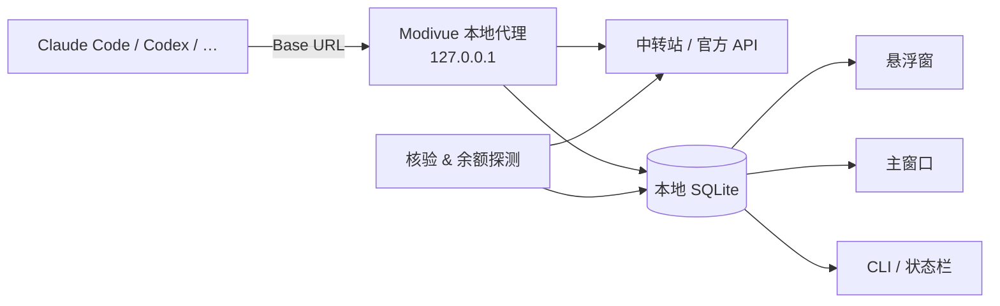

<!-- TODO: 素材放到 docs/assets/ 下；深浅色两套图可用 <picture> 切换 -->
<div align="center">


# Modivue

**vibe coding 的模型仪表盘**<br>
中转站余额 · 缓存命中 · 首字延迟 · 模型核验 —— 悬浮一眼看清，数据只留在本机

[](https://github.com/systemoutprintlnhelloworld/Modivue/actions/workflows/build.yml)
[](https://github.com/systemoutprintlnhelloworld/Modivue/releases)
[](https://github.com/systemoutprintlnhelloworld/Modivue/releases)


<!-- TODO: 补 LICENSE 后启用 -->
<!-- [](LICENSE) -->

**简体中文** · [English](README.en.md)

[下载](#-安装) · [它能回答什么](#-它能回答你什么问题) · [模型核验](#-模型核验) · [隐私](#-隐私与数据边界) · [更新日志](CHANGELOG.md)

<br>

<!-- TODO: 6–10 秒循环：极简态 → 悬停多 Agent 面板 → 悬停单环详情 → 收回 -->
<picture>
  <source media="(prefers-color-scheme: light)" srcset="docs/assets/hero-light.gif">
  
</picture>

</div>

## ✨ 为什么需要它

用 Claude Code / Codex 接中转站写代码时，你通常不知道：**余额还剩多少、缓存到底命中没有、为什么今天首字这么慢、这个"模型"是不是它自称的那个。**
Modivue 在本机起一个代理，记录每一次请求的真实数据，用一个不打扰的悬浮窗告诉你答案。

## 🫧 三层悬浮窗：不打扰，需要时再展开

| 极简态 | 悬停：Agent 面板 | 悬停单环：详情与趋势 |
|:---:|:---:|:---:|
|  |  |  |
| 只显示余额环 | 正在工作及 1 小时内活跃的 Agent | 核验 / Cache / TTFT / 余额数值与最近 1 小时曲线 |

悬浮窗支持拖动与左右吸附；点击模型打开主窗口，查看完整统计、日志、核验报告与设置。`⌘K` / `Ctrl+K` 随时搜索功能。

## 🎯 它能回答你什么问题

| | 指标 | 回答的问题 |
|:---:|---|---|
| 🟢 | **模型核验** | 这个渠道返回的模型，和可信来源的行为是否一致？ |
| 🔴 | **Cache 命中率** | 提示词缓存真的生效了吗？（按协议读取 `cached_tokens` / `cache_read_input_tokens`） |
| 🟣 | **TTFT 首字延迟** | 慢在哪个渠道、哪个时段？（从首个有效文本或工具事件计时） |
| 🩵 | **余额** | 中转站还剩多少？支持 OpenRouter、New API / Sub API 及自定义 JSON 字段映射 |

所有指标按 **模型 × 渠道 × Key 分组 × 推理档位** 分开统计，不会把不同路由混成一个结论。


## 🧪 模型核验

核验结果是**行为证据**，不是人类 IQ，也不是模型身份认证。你可以按需选择方法：

| 方法 | 它在看什么 | 需要可信基准 |
|---|---|---|
| 单问题测试 | 自定义题目 + 参考答案，持续统计匹配率 | 否 |
| Meow 模型指向 | 短答案分布更接近候选池中的哪个模型 | 内置 |
| HLWY 分布匹配 | 与公共分布或可信 API 对比 | 可选 |
| KBF 知识边界 | 与公开历史模型的知识边界对比 | 内置 |
| One Token / Astra | 分布指纹采集与对比 | 需先在可信渠道采集 |
| Juice 观测 | 原始观测，配合可信校准使用 | 可选 |
| BazaarLink / Ztest | 接入官方检测，导入报告 | 官方服务 |

> 核验会产生 token 费用，Modivue 会逐请求显示花费；未知费用显示为"未知"，不会记为 0。
> 详细原理与局限见 [MODEL-VERIFICATION.md](MODEL-VERIFICATION.md)。


## 📦 安装

### macOS（Apple Silicon）

从 [Releases](https://github.com/systemoutprintlnhelloworld/Modivue/releases) 下载并解压，把 `Modivue.app` 拖进"应用程序"。

> 预览版尚未经过 Apple 公证。首次打开如果被拦截，到"系统设置 → 隐私与安全性"中点"仍要打开"，或执行：
> ```bash
> xattr -cr /Applications/Modivue.app
> ```

### Windows（预览）

解压 `Modivue-windows-x64.zip`，运行 `Modivue.exe`。需要 Microsoft Edge WebView2 Runtime。

### 接入你的 Agent

把 Agent 的 Base URL 指向本机代理：

```text
OpenAI 协议     http://127.0.0.1:4173/proxy/openai/v1
Anthropic 协议  http://127.0.0.1:4173/proxy/anthropic/v1
```

Claude Code 还可以接入状态栏，见 [状态栏接入说明](cli/STATUSLINE-SNIPPET.md)。Codex 会话会被自动识别。

<details>
<summary><b>多渠道路由 · 命令行工具 · 从源码构建</b></summary>

```bash
# 多渠道
MODIVUE_UPSTREAMS='{"openai":{"team-a":"https://openai-a.example/v1"}}' npm run dev
# → /proxy/openai/team-a/v1/...

# 命令行（只读本地 SQLite，不触发付费检测）
node cli/modivue.mjs status
node cli/modivue.mjs watch --interval 5
node cli/modivue.mjs agents --json

# 构建
npm ci
npm run desktop:build     # macOS → dist/Modivue.app
npm run windows:build     # Windows
npm run dev               # 浏览器调试 http://127.0.0.1:4173
```

</details>

## 🔒 隐私与数据边界

- 本地服务**只监听 `127.0.0.1`**，数据存在本机 SQLite
- 数据库只保存 API Key 的**不可逆短指纹**，不保存明文
- 主动探测和核验会消耗 token，受每日上限与间隔控制，可随时关闭
- 模型目录从 [models.dev](https://models.dev) 同步；这是唯一的默认外部请求

详见 [SECURITY.md](SECURITY.md)。

## 🏗️ 工作原理



## 🧩 支持的工具

已解析 15 个工具的提供方配置；Claude Code、Codex、Gemini、Qwen、Pi、OpenCode 已完成本地启动验证。完整列表与后续计划见 [ROADMAP.md](ROADMAP.md)。

## 🗺️ 最新版本

**v0.4.1**：三环、灵动岛和提示的英文完善；One Token 分布档案支持导出与校验。 → [全部更新日志](CHANGELOG.md)

## 🤝 参与

欢迎提交中转站适配、核验方法和翻译。请先阅读 [CONTRIBUTING.md](CONTRIBUTING.md)，提交 issue 时请附上系统、Agent 与协议类型。

[](https://star-history.com/#systemoutprintlnhelloworld/Modivue&Date)

## 📄 许可证

<!-- TODO: 选定许可证后补全 -->
[MIT](LICENSE) © systemoutprintlnhelloworld